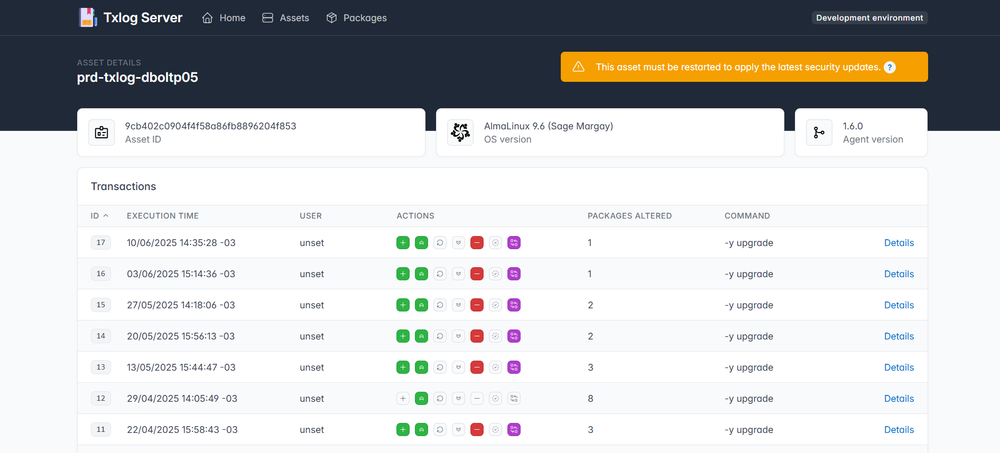
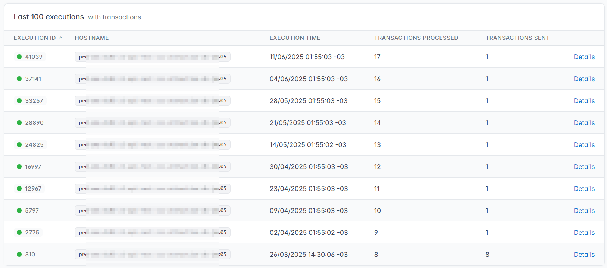
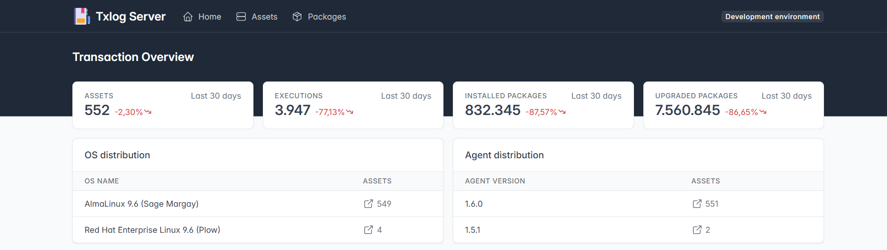
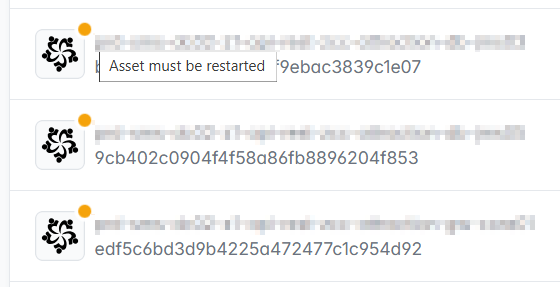
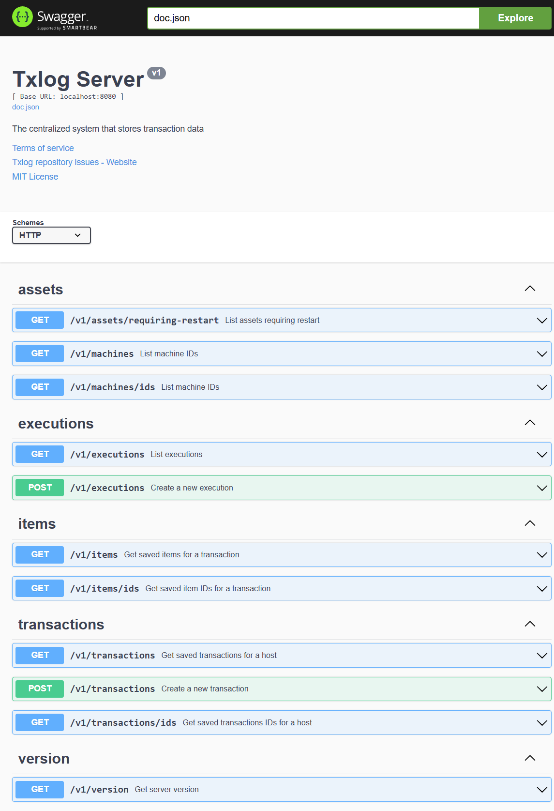

# Txlog Server

Txlog Server is a robust transaction log management system designed to handle
and process business transactions in a reliable and efficient manner. It serves
as a centralized platform for recording, monitoring, and managing transaction
logs across different services and applications. The server is particularly
useful in distributed systems where maintaining a consistent and accurate record
of transactions is crucial for data integrity and system reliability.

The primary purpose of Txlog Server is to provide a dependable mechanism for
tracking transaction states, ensuring data consistency, and facilitating error
recovery in case of system failures. It acts as a single source of truth for
transaction history, making it an essential component for businesses that
require precise transaction tracking and audit capabilities.

In addition, the Txlog Server provides detailed information in the asset listing
regarding whether a system restart is required to apply security updates. This
feature is crucial for maintaining operational security and minimizing downtime,
as it allows administrators to quickly identify assets that need immediate
attention. By clearly indicating which updates are pending and whether a restart
is necessary, the server helps ensure that critical patches are applied
promptly, reducing the risk of vulnerabilities being exploited. This proactive
approach supports compliance with security best practices and enables efficient
planning for maintenance windows, ultimately contributing to the reliability and
safety of the entire system.

## System Requirements

Before running Txlog Server, ensure you have access to a PostgreSQL database
server that will store the transaction logs and related data. You need to
create a blank database; the tables are created when the server starts.

```sql
CREATE DATABASE "txlog" WITH ENCODING = 'UTF8';
```

## Installation

The Txlog server can be easily deployed using Docker or using kuberentes. First,
pull the container image from the GitHub Container Registry:

::: code-group

```bash [Docker]
docker run -d -p 8080:8080 \`
  -e INSTANCE=My Datacenter \
  -e LOG_LEVEL=ERROR \
  -e PGSQL_HOST=postgres.example.com \
  -e PGSQL_PORT=5432 \
  -e PGSQL_USER=txlog \
  -e PGSQL_DB=txlog \
  -e PGSQL_PASSWORD=your_db_password \
  -e PGSQL_SSLMODE=require \
  -e CRON_RETENTION_DAYS=7 \
  -e CRON_RETENTION_EXPRESSION=0 2 * * * \
  -e CRON_STATS_EXPRESSION=0 1 * * * \
  cr.rda.run/txlog/server:main
```

```yaml [Kubernetes]
apiVersion: apps/v1
kind: Deployment
metadata:
  name: txlog-server
spec:
  replicas: 3
  selector:
    matchLabels:
      app: txlog-server
  template:
    metadata:
      labels:
        app: txlog-server
    spec:
      containers:
      - name: txlog-server
        image: cr.rda.run/txlog/server:main
        ports:
        - containerPort: 8080
        livenessProbe:
          httpGet:
            path: /health
            port: 8080
          initialDelaySeconds: 5
          periodSeconds: 10
        readinessProbe:
          httpGet:
            path: /health
            port: 8080
          initialDelaySeconds: 5
          periodSeconds: 10
        env:
        - name: INSTANCE
          value: "My Datacenter"
        - name: LOG_LEVEL
          value: "ERROR"
        - name: PGSQL_HOST
          value: "postgres.example.com"
        - name: PGSQL_PORT
          value: "5432"
        - name: PGSQL_USER
          value: "txlog"
        - name: PGSQL_DB
          value: "txlog"
        - name: PGSQL_PASSWORD
          valueFrom:
            secretKeyRef:
              name: txlog-secrets
              key: db-password
        - name: PGSQL_SSLMODE
          value: "require"
        - name: CRON_RETENTION_DAYS
          value: 7
        - name: CRON_RETENTION_EXPRESSION
          value: "0 2 * * *"
        - name: CRON_STATS_EXPRESSION
          value: "0 1 * * *"
        - name: IGNORE_EMPTY_EXECUTION
          value: true
```

:::

If you want to use a production (stable) version, replace `main` by the version
number (e.g. `v1.0`) in the Docker commands and Kubernetes configuration.

## Options

The Txlog Server can be configured using the following environment variables:

| Variable | Description | Example |
|----------|-------------|---------|
| `INSTANCE` | A name to identify this server instance | `My Datacenter` |
| `LOG_LEVEL` | The logging level (DEBUG, INFO, WARN, ERROR) | `ERROR` |
| `PGSQL_HOST` | PostgreSQL server hostname | `postgres.example.com` |
| `PGSQL_PORT` | PostgreSQL server port | `5432` |
| `PGSQL_USER` | PostgreSQL username | `txlog` |
| `PGSQL_DB` | PostgreSQL database name | `txlog` |
| `PGSQL_PASSWORD` | PostgreSQL user password | `your_db_password` |
| `PGSQL_SSLMODE` | PostgreSQL SSL mode (disable, require, verify-full) | `require` |
| `CRON_RETENTION_DAYS` | Number of days to keep transaction logs | `7` |
| `CRON_RETENTION_EXPRESSION` | Cron expression for log cleanup job | `0 2 * * *` |
| `CRON_STATS_EXPRESSION` | Cron expression for statistics generation | `0 1 * * *` |
| `IGNORE_EMPTY_EXECUTION` | Skip logging of empty executions | `true` |

## Authentication

Currently, the server does not support built-in authentication, although the
agent does. To secure your server, you can use a reverse proxy with basic
authentication (like [Caddy](https://caddyserver.com/) or
[Nginx](https://www.nginx.com/)) in front of the Txlog Server. Then, configure
the [agent](https://txlog.rda.run/docs/agent#configuration) with the appropriate
username and password to match your proxy's authentication settings.

## UI and API

Once the server is running, you can access its interface at `http://<server-address>:8080`. From there, you can:

### View all collected transaction logs

Transaction logs for each asset provide valuable insights into what software
packages or updates have been installed and the exact time of installation. By
reviewing these logs, administrators can track changes to system components,
verify compliance with update policies, and quickly identify the source of
recent modifications. This level of visibility is essential for auditing,
troubleshooting, and ensuring that all assets remain up-to-date and secure.





### Monitor package statistics

Package statistics provide a comprehensive overview of how updates are being
distributed across all assets in the system. By analyzing these statistics,
administrators can identify which assets have received the latest security
patches and which ones are pending updates. This visibility enables proactive
management of vulnerabilities, ensuring that critical updates are delivered
promptly and consistently. As a result, monitoring package statistics not only
streamlines update deployment but also significantly enhances the overall
security posture by reducing the risk of unpatched systems being exploited.



### Track server restarts

Server restarts are crucial for applying updates and ensuring system stability.
By tracking when a server was last restarted, administrators can determine if
the latest updates have been applied successfully. This information is vital for
maintaining operational efficiency and security, as it helps identify any
pending restarts that may be necessary to complete the update process. By
keeping a record of server restarts, organizations can ensure that their systems
are running the most current software versions, thereby minimizing
vulnerabilities and enhancing overall performance.



### Access the API documentation through Swagger UI

The Txlog Server provides a comprehensive API for interacting with transaction
logs and statistics. You can access the API documentation through Swagger UI at
`http://<server-address>:8080/swagger`. This interface allows developers to
explore available endpoints, understand request and response formats, and test
API calls directly from the browser.


