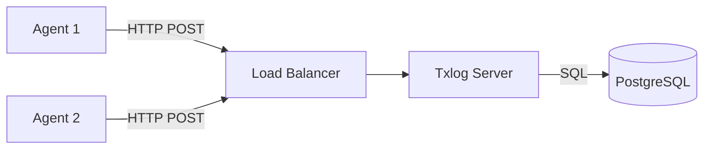

# Architecture Overview

Txlog Server is a centralized system designed to collect, store, and visualize transaction logs and asset data from
distributed agents.

## High-Level Architecture

The system follows a classic **Client-Server** architecture:

1. **Agents (Clients)**: Installed on servers (Linux RPM-based). They collect DNF/YUM transaction history and system
    metadata and push it to the server via HTTP/JSON.
2. **Server**: A monolithic Go application that receives data, processes it, and stores it in a relational database.
3. **Database**: PostgreSQL serves as the single source of truth for all data.

## Technology Stack

- **Language**: Go (Golang) 1.22+
- **Web Framework**: Gin (High-performance HTTP web framework)
- **Database**: PostgreSQL 13+
- **Frontend**: Server-side rendered HTML (Go Templates) with vanilla CSS/JS.
- **Scheduling**: Internal Go routines with distributed locking.

## Key Design Decisions

### 1. Asset Management (Logical vs. Physical Identity)

One of the core challenges in infrastructure monitoring is distinguishing between a *logical* server
(e.g., "web-01") and its *physical* instantiation.

- **Problem**: If "web-01" is re-imaged, it generates a new `/etc/machine-id`. To a naive system,
    this looks like a new server, breaking history continuity.
- **Solution**: The `AssetManager` (`models/asset_manager.go`) implements a logic to link
    `hostname` (logical ID) with `machine_id` (physical ID).
  - When a new `machine_id` reports with an existing `hostname`, the system automatically
        "deactivates" the old asset and creates a new active one.
  - This preserves the history of "web-01" across re-installations while maintaining an accurate
        audit trail of physical changes.

### 2. Distributed Scheduler

The server includes a built-in scheduler (`scheduler/main.go`) for background tasks like data
retention cleanup and statistics calculation.

- **Challenge**: In a high-availability deployment (e.g., Kubernetes with 3 replicas), we cannot
    have all 3 instances running the cleanup job simultaneously.
- **Solution**: **Distributed Locking via Database**.
  - Before running a job, the instance attempts to acquire a named lock in the `cron_lock` table
        (`INSERT ... ON CONFLICT DO NOTHING`).
  - Only the instance that successfully inserts the row executes the job.
  - This allows the scheduler to be simple (no external dependencies like Redis) yet robust for
        clustered deployments.

### 3. Authentication Strategy

The system supports a hybrid authentication model to cater to different user needs:

- **OIDC/LDAP**: For Humans (web interface). Integrates with enterprise identity providers.
- **No-Auth Mode**: For local development or isolated networks, reducing friction during initial setup.

## Data Flow

### Ingestion Pipeline

1. **Agent** sends a JSON payload to `/v1/executions`.
2. **Controller** (`controllers/api/v1/executions_controller.go`) validates the JSON.
3. **Asset Manager** updates the asset state (create/update/replace).
4. **Transaction Manager** inserts new transactions and links them to the asset.
5. **Response**: Server returns 200 OK.

### Visualization

1. **User** requests the dashboard (`/`).
2. **Controller** queries the database for aggregated statistics (cached for performance).
3. **Template Engine** renders the HTML with the data.
4. **Browser** displays the page (no client-side fetching for initial load).
