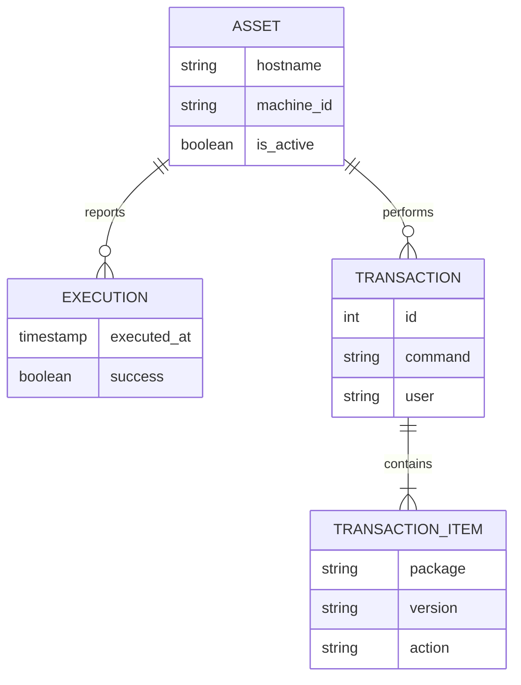

# Understanding the Data Model

This document explains the conceptual data model of Txlog Server and how different entities relate to each other.

## Core Entities

### 1. Asset (The "Who")

An **Asset** represents a managed machine. It is the central entity to which all other data is attached.

- **Key Concept**: Separation of `Hostname` and `MachineID`.
- **Hostname**: The stable, human-readable name (e.g., `db-prod-01`).
- **MachineID**: The unique identifier of the OS installation.
- **Lifecycle**: An asset is "Active" until a new MachineID appears for the same Hostname, at which point the old one
  becomes "Inactive".

### 2. Execution (The "When")

An **Execution** represents a single "check-in" or "run" of the Txlog Agent.

- It captures the state of the machine at a specific point in time.
- It acts as a heartbeat.
- Contains metadata like Agent Version, OS Version, and Success/Failure status.

### 3. Transaction (The "What")

A **Transaction** corresponds to a specific DNF/YUM operation (e.g., "Update 5 packages").

- Linked to a specific Asset (via MachineID).
- Contains the command line run (e.g., `dnf update -y`).
- Contains the user who ran it.

### 4. Transaction Item (The "Details")

A **Transaction Item** is a granular record of a single package being changed within a Transaction.

- Example: "Package `kernel` was `Upgraded` from `5.14` to `5.15`".
- Allows for fine-grained querying (e.g., "Find all servers running openssl 1.1.1").

## Entity Relationships

## Design Considerations

### Why Composite Keys?

You might notice that `transactions` use a composite primary key (`transaction_id`, `machine_id`).

- **Reason**: The `transaction_id` comes from the RPM database (BDB/Sqlite) on the client machine. It is unique *per
  machine* but not globally.
- **Impact**: To uniquely identify a transaction globally, we must combine the local ID with the machine's unique ID.

### Why Immutable History?

The system is designed to be an **Audit Log**.

- Data is rarely updated after insertion (except for the `last_seen` timestamp on Assets).
- Executions and Transactions are append-only.
- This ensures the integrity of the historical record.
